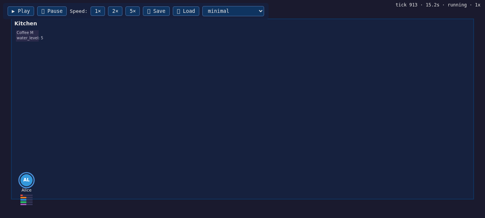
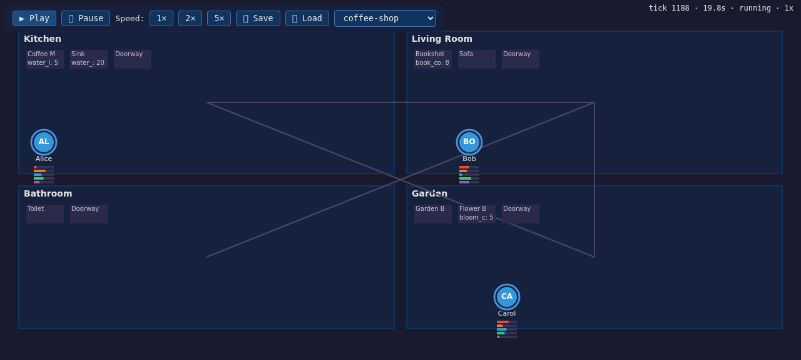
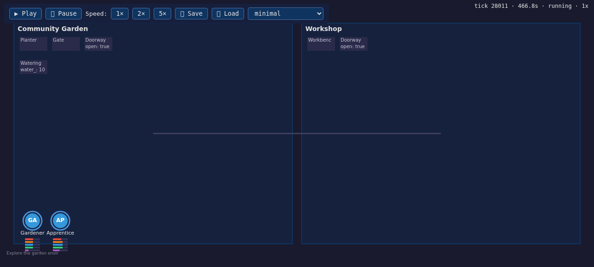

# evol-hive

> **LLM-Driven Game Engine** — Autonomous NPCs with embodied cognition in a deterministic physics simulation.

## Vision

Evol-hive is a next-generation simulation engine where NPCs are fully autonomous, truly intelligent, and seamlessly integrated with deterministic game physics. We move beyond scripted behavior trees and rigid prompt-chained AI architectures toward real-time, computationally efficient **embodied cognition** using local LLMs.

The paradigm shift: instead of treating AI as an external text generator, we treat cognitive functions (planning, remembering, reflecting) as **intrinsic tools within the game world itself**. Strict Structured Outputs bridge the chaotic non-determinism of LLMs with the rigid determinism of a TypeScript physics engine.

## Architecture

The system is a hybrid engine combining:
- **Deterministic game mechanics** (TypeScript) — physics, spatial management, game loop
- **Non-deterministic agent cognition** (Local LLMs) — via Ollama, vLLM, or llama.cpp

Built around a fluid **PPER loop** (Perceive → Plan → Execute → Reflect) using Structured Outputs for stable execution.

### Key Concepts

| Concept | Section | Description |
|---------|---------|-------------|
| Agent Internal State | [§3](docs/architecture/03-agent-state-schema.md) | Strict state object anchoring agent behavior |
| Smart Objects & Affordances | [§4](docs/architecture/04-smart-objects.md) | Objects expose discrete actions; LLM sees only semantics |
| System 0 Classifier | [§5](docs/architecture/05-fast-path-classifier.md) | Fast embedding model prunes affordances before LLM |
| PPER Loop | [§6](docs/architecture/06-pper-loop.md) | Perceive, Plan, Execute, Reflect with spatial debouncing |
| Structured Outputs | [§7](docs/architecture/07-structured-outputs.md) | Strict JSON schema / grammar constraints |
| Cognitive Tools | [§8](docs/architecture/08-cognitive-tools.md) | Intrinsic tools: formulate_plan, query_memory, update_state |
| Async Engine Routing | [§9](docs/architecture/09-engine-routing.md) | is_thinking state, action feedback loop |
| Cognitive Guardrails | [§10](docs/architecture/10-cognitive-guardrails.md) | Affordance masking, contextual forcing, plan validation |
| Memory Architecture | [§11](docs/architecture/11-memory-architecture.md) | Dual-track injection, weighted retrieval, reflection |

## Visualizer

The simulation ships with a browser-based 2D canvas visualizer — rooms, smart objects, agents, drive bars, and live object state over WebSocket.






Run it:

```bash
npx tsx examples/visualizer-demo.ts
# Open http://localhost:3000
```

Controls: Play/Pause, speed (1x/2x/5x), Save/Load state, and a scene selector (minimal, morning-routine, coffee-shop).

### Dynamic World — living scenes (spec 030)

`dynamic-world-sim.ts` runs a 12-minute real-LLM simulation that mutates the scene live: an agent spawns mid-run, objects appear and move, a gate closes and reopens, and an agent despawns to dormancy and returns with its state restored — all visible on canvas without a reload.




```bash
USE_REAL_LLM=true npx tsx examples/dynamic-world-sim.ts
# Open http://localhost:3100
```

> Note: the demo runs a no-op mock orchestrator (rendering demo only). Agents do not perform PPER cycles — see issue [#106](https://github.com/Redna/evol-hive/issues/106) for wiring real LLM cognition into the demo.

## Project Structure

See [ADR-0001](docs/adr/0001-lean-monorepo-structure.md) for the rationale behind this structure.

```
evol-hive/
├── packages/
│   ├── shared/       — Shared types, JSON schemas, interfaces (no deps)
│   ├── engine/       — Deterministic game engine
│   │                   ├── loop/        — Game loop, engine systems
│   │                   ├── physics/     — Affordance execution, preconditions
│   │                   ├── spatial/     — Room management, spatial debouncing
│   │                   ├── routing/     — Async LLM concurrency, action routing
│   │                   ├── world/       — Smart objects, affordances, scenes
│   │                   └── agents/      — Agent state, drives, plans
│   ├── cognition/    — LLM cognitive layer
│   │                   ├── pper/        — PPER loop orchestration
│   │                   ├── llm/         — LLM client (Ollama, vLLM, llama.cpp)
│   │                   ├── tools/       — Cognitive tools (formulate_plan, query_memory, ...)
│   │                   ├── guardrails/  — Affordance masking, contextual forcing, plan validation
│   │                   ├── classifier/  — System 0: embedding model, affordance pruning
│   │                   └── schemas/     — Prompt templates, structured output config
│   └── memory/       — Memory architecture
│                       ├── store/       — Vector store (in-memory, LanceDB, ChromaDB)
│                       ├── retrieval/   — Weighted scoring (recency × importance × relevance)
│                       └── reflection/  — Background reflection & consolidation
├── docs/
│   ├── architecture/ — Architecture specification documents (§1-§11)
│   └── adr/          — Architecture Decision Records
├── config/           — Runtime configuration
└── .github/workflows — CI/CD pipelines
```

### Dependency Graph

```
shared ←── engine
shared ←── cognition
shared ←── memory
memory  ←── cognition
```

## Getting Started

### Prerequisites

- Node.js ≥ 20
- pnpm ≥ 9
- A local LLM backend (Ollama recommended)

### Installation

```bash
git clone https://github.com/Redna/evol-hive.git
cd evol-hive
pnpm install
cp .env.example .env  # Configure your LLM & embedding settings
```

### Development

```bash
pnpm build        # Build all packages
pnpm dev          # Watch mode for all packages
pnpm test         # Run tests across all packages
pnpm typecheck    # TypeScript type checking
pnpm lint         # ESLint
pnpm format       # Prettier formatting
```

## License

MIT